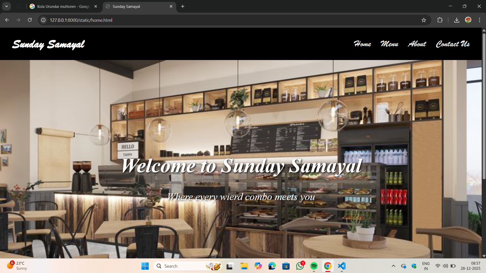
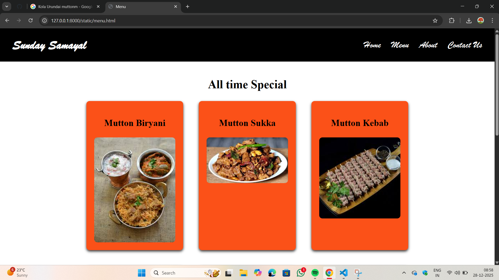
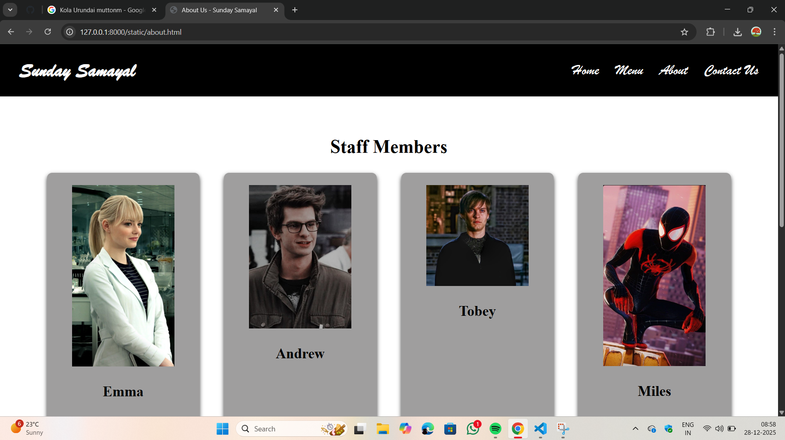
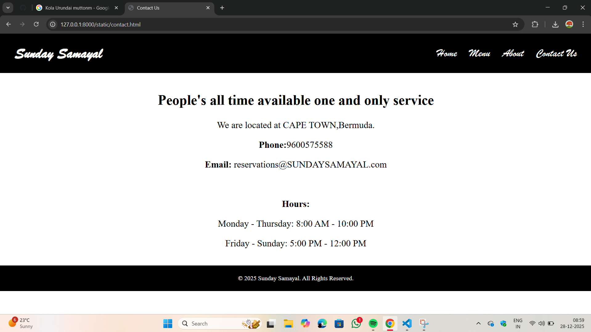

# Ex.06 Restaurant Website
## Date:28-12-2025

## AIM:
To develop a static Restaurant website to display the food items and services provided by them.

## DESIGN STEPS:

### Step 1:
Requirement collection.

### Step 2:
Creating the layout using HTML and CSS.

### Step 3:
Updating the sample content.

### Step 4:
Choose the appropriate style and color scheme.

### Step 5:
Validate the layout in various browsers.

### Step 6:
Validate the HTML code.

### Step 7:
Publish the website in the given URL.

## PROGRAM:
~~~
home

<!DOCTYPE html>
<html lang="en">
<head>
    <meta charset="UTF-8">
    <meta name="viewport" content="width=device-width, initial-scale=1.0">
    <title>Sunday Samayal</title>
    <link rel="stylesheet" href="style.css">
</head>
<body>
    <header>
        <h1>Sunday Samayal</h1>
        <nav>
            <ul>
                <li><a href="home.html">Home</a></li>
                <li><a href="menu.html">Menu</a></li>
                <li><a href="about.html">About</a></li>
                <li><a href="contact.html">Contact Us</a></li>
            </ul>
        </nav>
    </header>
    <section id="home" class="home">      
        <h1>Welcome to Sunday Samayal</h1>
        
Where every wierd combo meets you

    </section>
     <section id="story"class="story">
            <h2>Our Story</h2>
            

               Sunday Samayal was founded by the honoured chancellor Bavin Balaji who started his business carrier in a tea stall.
            

        </section>
    <footer>
        
&copy; 2025 Sunday Samayal. All Rights Reserved.

    </footer>
</body>
</html>

contact

<!DOCTYPE html>
<html lang="en">
<head>
    <meta charset="UTF-8">
    <meta name="viewport" content="width=device-width, initial-scale=1.0">
    <title>Contact Us</title>
    <link rel="stylesheet" href="style.css">
</head>
<body>
     <header>
        <h1>Sunday Samayal</h1>
        <nav>
            <ul>
                <li><a href="home.html">Home</a></li>
                <li><a href="menu.html">Menu</a></li>
                <li><a href="about.html">About</a></li>
                <li><a href="contact.html">Contact Us</a></li>
            </ul>
        </nav>
    </header>
    <section id="contact" class="story">
             <h2>People's all time available one and only service</h2>
            
We are located at CAPE TOWN,Bermuda.

            
<strong>Phone:</strong>9600575588

            
<strong>Email:</strong> reservations@SUNDAYSAMAYAL.com

             
            
<strong>Hours:</strong>

            
Monday - Thursday: 8:00 AM - 10:00 PM

            
Friday - Sunday: 5:00 PM - 12:00 PM

    </section>
    <footer>
        
&copy; 2025 Sunday Samayal. All Rights Reserved.

    </footer>
</body>
</html>

menu

<!DOCTYPE html>
<html lang="en">
<head>
    <meta charset="UTF-8">
    <meta name="viewport" content="width=device-width, initial-scale=1.0">
    <title>Menu</title>
    <link rel="stylesheet" href="style.css">
</head>
<body>
    <header>
    <h1>Sunday Samayal</h1>
        <nav>
            <ul>
                <li><a href="home.html">Home</a></li>
                <li><a href="menu.html">Menu</a></li>
                <li><a href="about.html">About</a></li>
                <li><a href="contact.html">Contact Us</a></li>
            </ul>
        </nav>
    </header>
    <section id="menu" class="story">
        <h2>All time Special</h2>
        

            

                <h3>Mutton Biryani</h3>
                
                         

            

                <h3>Mutton Sukka </h3>
                
                
            

            

                <h3>Mutton Kebab</h3>
                
                
            

            

                <h3>Mutton Ghee Roast</h3>
                
                
            

            

                <h3>Mutton Mandi Set</h3>
                
                
            

            

                <h3>Madurai's top class Mutton Dosa</h3>
                
                
            

            

                <h3>Dindigul Style Biryani(C&M)</h3>
                
              
            

            

                <h3>Mutton Kola Urundai</h3>
                
                
            

        

    </section>
    <footer>
        
&copy; 2025 Sunday Samayal. All Rights Reserved.

    </footer>
</body>
</html>

about

<!DOCTYPE html>
<html lang="en">
<head>
    <meta charset="UTF-8">
    <meta name="viewport" content="width=device-width, initial-scale=1.0">
    <title>About Us - Sunday Samayal</title>
    <link rel="stylesheet" href="style.css">
</head>
<body>
    <header>
       <h1>Sunday Samayal</h1>
        <nav>
            <ul>
                <li><a href="home.html">Home</a></li>
                <li><a href="menu.html">Menu</a></li>
                <li><a href="about.html">About</a></li>
                <li><a href="contact.html">Contact Us</a></li>
            </ul>
        </nav>
    </header>
    <section id="about">
        <h2>Staff Members</h2>
        

            

                
                <h3>Emma</h3>
            

            

                
                <h3>Andrew</h3>
            

            

                
                <h3>Tobey</h3>
            

            

                            
                 <h3>Miles</h3>
                

            

               
                 <h3>Tom</h3>
            

        

    </section>
    <footer>
        
&copy; 2025 Sunday Samayal. All Rights Reserved.

    </footer>
</body>
</html>

style.css
body{
            font-family: 'Times New Roman', Times, serif;
            margin: 0;
            padding: 0;
            background-color: #ffffff;
            color: #000000;
        }
        header{
            background-color: #000000;
            color: white;
            font-family: 'brush script mt', cursive;
            font-size: 1.2em;
            padding: 0.1em 2em;
            display: flex;
            position: sticky;
            justify-content: space-between;
            align-items: center;     
        }
        nav ul{
            list-style: none;
            margin: 0;
            padding: 0;
            display: flex;
            gap: 2rem;
        }
        nav a{
            color: white;
            text-decoration: none;
            font-size: 1.5em;
        }
        .home{
            background: url('rest.jpeg') center/cover no-repeat;
            height: 100vh;
            padding: 0.1em 0em;
            text-align: center;
            align-content: center;
            color:#ffffff;
            font-size: 2em;
            font-family:'Playfair Display', serif;
            font-style:italic;
            text-shadow: 2px 2px 6px #000;
        }
        section{
            text-align: center;
            font-size: 1.5em;
            font-family: 'Playfair Display', serif;
            font-style: bold;
            padding: 2em;
        }
        .menu {
            display: flex;
            justify-content: center;
            flex-wrap: wrap;
            gap: 2em;
        }
        .items {
            background-color: #fb5118;
            border-radius: 10px;
            box-shadow: 0 4px 8px rgba(0, 0, 0, 0.815);
            padding: 1em;
            width: 250px;
        }
        .items img{
            width: 100%;
            border-radius: 10px;
        }
        .story{
        max-width: 1200px;
        margin: 0 auto;
        padding: 20px;
        }
        .staff{
            background-color: #9f9e9e;
            border-radius: 10px;
            box-shadow: 0 4px 8px rgba(0, 0, 0, 0.815);
            padding: 1em;
            width: 250px;
        }
        footer {
        background-color: #000000;
        color: white;
        text-align: center;
        padding: 0.5em;
        }
~~~

## OUTPUT:

## RESULT:
The program for designing software company website using HTML and CSS is completed successfully.
